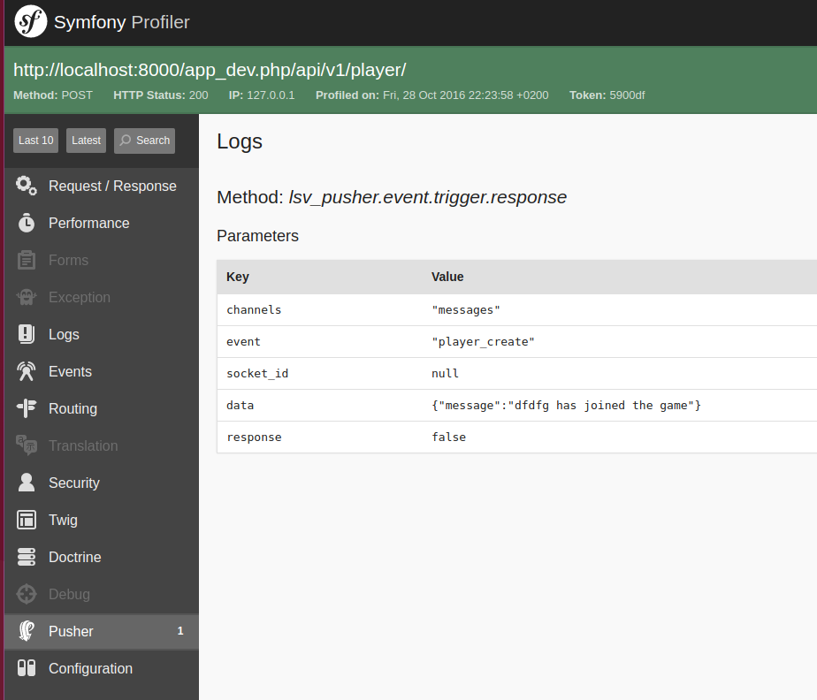

Lsv Pusher Bundle
=================

Pusher.com bundle for symfony, and it is very cool

# Install

```
composer require lsv/pusher-bundle
```

Add the bundle to your AppKernel

```php
# app/AppKernel.php
public function registerBundles()
{
    $bundles = [
        new Lsv\PusherBundle\LsvPusherBundle(),
    ];
}
```

Add the needed configuration

```yml
lsv_pusher:
    app_id: <Your app key>
    key: <Your app id>
    secret: <Your app secret>
```

There is more [configuration availible](#configuration)

# Usage

### Controller example

In your controller you can use

```php
$this->get('lsv_pusher.pusher')->trigger('channel', 'event-name', $data);
```

This will be a `Lsv\PusherBundle\Service\PusherService` object, which extends `\Pusher` from `pusher/pusher-php-server`

Why I extend the original, is because it is not possible to add middlewares to the original, so I added them in my own

As my service extends the original, you can use all the same methods as in https://github.com/pusher/pusher-http-php

### Your service

In your service you can add this to your arguments

```yml
services:
    your-service:
         class: YourClass
         arguments: ["@lsv_pusher.pusher"]
```

And in your YourClass

```php
use Lsv\PusherBundle\Service\PusherService

class YourClass
{
    public function __construct(PusherService $pusher)
    {
    }
}
```

# Configuration

| Key | Description | Required | Default value | Type |
| --- | --- | --- | --- | --- |
| app_id | Your pusher.com app_id | true | | string
| key | Your pusher.com key | true | | string
| secret | Your pusher.com secret | true | | string
| host | Pusher host | false | api.pusherapp.com | string
| timeout | HTTP timeout | false | null | integer
| encrypted | Do you want to push over HTTPS | false | false | boolean
| cluster | Which cluster are you using, will overwrite your host configuration | false | null | string
| curl_options | Additional options to send with curl, [more information](#curl_options-info) | false | null | array
| debug | Add debug | false | false | boolean

*Even if `debug` is false, all events will be send, and info will be send to symfony profiler*

### Full configuration example

```yml
lsv_pusher:
    app_id: 123
    key: 123
    secret: 123
    timeout: 20
    encrypted: true
    cluster: eu
    curl_options:
        - CURLOPT_IPRESOLVE: CURL_IPRESOLVE_V4
    debug: true
```

### curl_options Info

If you a add the constant to curl_options like this

```yml
lsv_pusher:
    curl_options:
        - CURLOPT_IPRESOLVE: CURL_IPRESOLVE_V4
        - CURLOPT_SSL_VERIFYSTATUS: false
```
       
The constant will be translated to the corresponded integer

### Symfony 3.2+
 
In symfony 3.2+, you can do this

```yml
lsv_pusher:
    curl_options:
        - !php/const:CURLOPT_IPRESOLVE: !php/const:CURL_IPRESOLVE_V4
        - !php/const:CURLOPT_SSL_VERIFYSTATUS: false
```

# Events

| Event | When | Class | Methods |
| --- | --- | --- | --- |
| `lsv_pusher.event.trigger` | Before trigger is send | TriggerEvent | `getChannels()` An array of channel names to publish the event on.<br><br>`getEvent()` Event name<br><br>`getData()` Event data<br><br>`getSocketId()`<br><br>`isDebug()`<br><br>`isAlreadyEncoded()`
| `lsv_pusher.event.trigger.response` | After trigger is send, including the response | TriggerResponseEvent | Same as `lsv_pusher.event.trigger` but with `getResponse()` 
| `lsv_pusher.event.triggerbatch` | Before triggerBatch is send | TriggerBatchEvent | `getBatch()` - Array of triggers<br><br>`isDebug()`<br><br>`isAlreadyEncoded()`
| `lsv_pusher.event.triggerbatch.response` | After triggerBatch is send, including the response | TriggerBatchResponseEvent | Same as `lsv_pusher.event.triggerbatch` but with `getResponse()`
| `lsv_pusher.event.channelinfo` | Before get_channel_info is send | ChannelInfoEvent | `getChannel()` The name of the channel<br><br>`getParams()` Additional parameters for the query
| `lsv_pusher.event.channelinfo.response` | After get_channel_info is send, including the response | ChannelInfoResponseEvent | Same as `lsv_pusher.event.channelinfo` but with `getResponse()`
| `lsv_pusher.event.channels` | Before get_channels is send | ChannelsEvent | `getParams()` Additional parameters for the query
| `lsv_pusher.event.channels.response` | After get_channels is send, including the response | ChannelsResponseEvent | Same as `lsv_pusher.event.channels` but with `getResponse()`
| `lsv_pusher.event.get` | Before get is send | GetEvent | `getPath()` Path excluding /apps/APP_ID<br><br>`getParams()` API params
| `lsv_pusher.event.get.response` | After get is send, including the response | GetResponseEvent | Same as `lsv_pusher.event.get` but with `getResponse()`

All event classes are in the namespace of `Lsv\PusherBundle\Event`

In all event classes you can use the NAME constant to get the dispatched event name, fx `Lsv\PusherBundle\Event\TriggerBatchEvent::NAME` 

# Symfony profiler

All response requests will be shown in the profiler, just like this



# Command

One command is provided to test a pusher.cosend the test to trigger

lsv:pusher:test

Optional options can also be added

| Option | Description | Type | Default value |
| --- | --- | --- | --- |
| --channels | Channels to send a test push to | string, array | array(test1, test2)
| --event | Event name to send the test push to | string | test
| --data | Event data to send the test push to | string, array | test

# License

The MIT License (MIT)

Copyright (c) 2016 Martin Aarhof

Permission is hereby granted, free of charge, to any person obtaining a copy
of this software and associated documentation files (the "Software"), to deal
in the Software without restriction, including without limitation the rights
to use, copy, modify, merge, publish, distribute, sublicense, and/or sell
copies of the Software, and to permit persons to whom the Software is
furnished to do so, subject to the following conditions:

The above copyright notice and this permission notice shall be included in all
copies or substantial portions of the Software.

THE SOFTWARE IS PROVIDED "AS IS", WITHOUT WARRANTY OF ANY KIND, EXPRESS OR
IMPLIED, INCLUDING BUT NOT LIMITED TO THE WARRANTIES OF MERCHANTABILITY,
FITNESS FOR A PARTICULAR PURPOSE AND NONINFRINGEMENT. IN NO EVENT SHALL THE
AUTHORS OR COPYRIGHT HOLDERS BE LIABLE FOR ANY CLAIM, DAMAGES OR OTHER
LIABILITY, WHETHER IN AN ACTION OF CONTRACT, TORT OR OTHERWISE, ARISING FROM,
OUT OF OR IN CONNECTION WITH THE SOFTWARE OR THE USE OR OTHER DEALINGS IN THE
SOFTWARE.